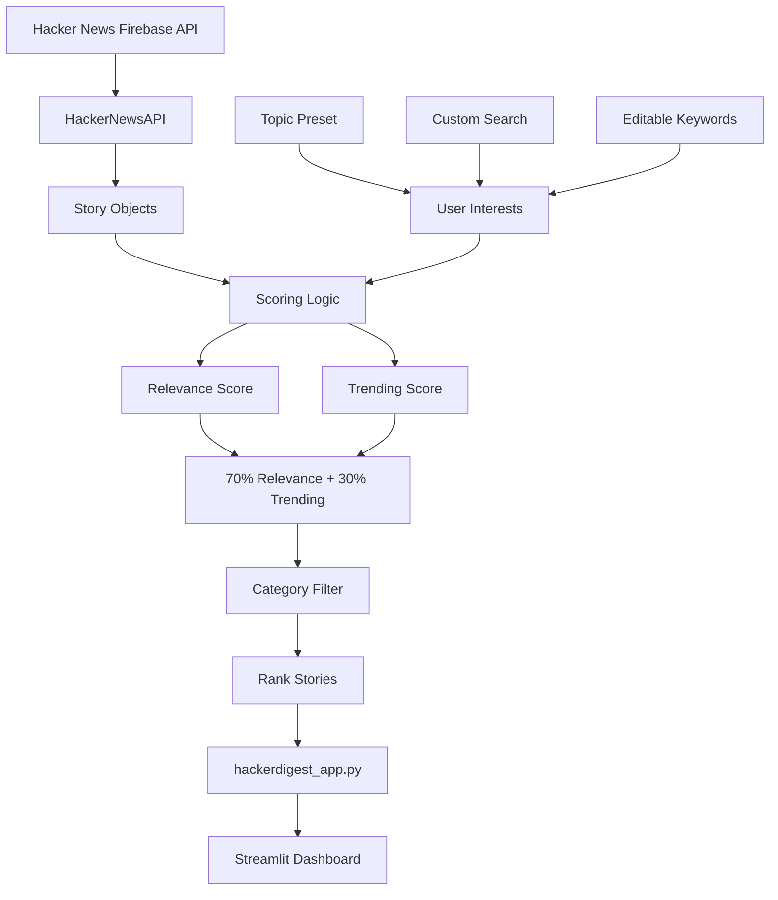

# HackerDigest

Personalised Hacker News Feed and Story Ranking Dashboard

HackerDigest fetches live Hacker News stories and ranks them based on a user's
technical interests using relevance and time-aware trending scores. Built with
Python and Streamlit.

---

## Features

- Live Hacker News top stories
- Personalised story ranking
- Five technical topic presets
- Custom keyword search
- Editable interest keywords
- Story, Ask HN, Show HN, and Jobs filters
- Top 10, 20, or 30 results
- Relevance, trending, and final match scores
- Story points, comments, author, age, and domain
- Direct article and Hacker News discussion links
- 10-minute API caching
- Streamlit dashboard

---

## How It Works

1. Fetch — gets up to 50 top stories from the Hacker News API
2. Model — converts API responses into `Story` objects
3. Match — compares story titles with the user's interests
4. Trend — scores stories using points and age
5. Rank — combines relevance (70%) and trending (30%)
6. Filter — applies the selected story category
7. Display — shows the personalised feed in Streamlit

---

## Architecture



The project keeps API communication, story modelling, ranking logic, and the
Streamlit interface separate.

---

## File Structure

```text
HackerDigest/
├── hackerdigest_app.py   — Streamlit dashboard
├── hn_api.py             — Hacker News API communication
├── models.py             — Story class
├── scorer.py             — Ranking and scoring logic
├── requirements.txt
├── .gitignore
└── README.md
```

---

## Tech Stack

- Python
- Streamlit
- Hacker News Firebase API
- urllib
- JSON
- HTML/CSS

No Hacker News API key is required.

---

## Getting Started

```bash
git clone https://github.com/yourusername/hackerdigest.git
cd hackerdigest
pip install -r requirements.txt
streamlit run hackerdigest_app.py
```

---

## Ranking Methodology

HackerDigest uses a transparent scoring heuristic.

**Relevance**

```text
Relevance = matched interests / total interests × 100
```

**Trending**

```text
Trending = story points / (hours old + 2)
```

Trending is capped at 100.

**Final Match Score**

```text
Final Score = (Relevance × 70%) + (Trending × 30%)
```

Stories are ranked from highest to lowest final score.

---

## Topic Presets

- AI & Machine Learning
- Web & Full-Stack
- Cloud & DevOps
- Data & Databases
- Developer Tools & Open Source

Users can also edit the keywords or enter custom search terms.

---

## Data Source

HackerDigest uses the public Hacker News Firebase API:

```text
/v0/topstories.json
/v0/item/{story_id}.json
```

Story data includes the title, author, points, comments, timestamp, and URL.

API results are cached for 10 minutes to reduce unnecessary requests.
